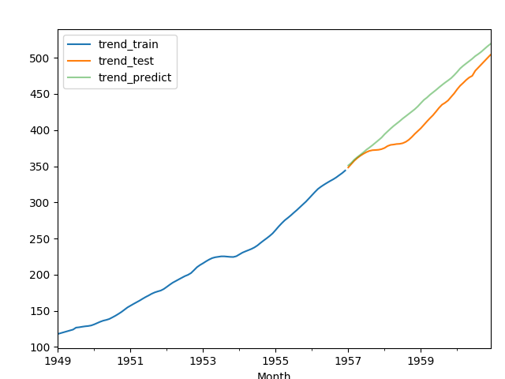
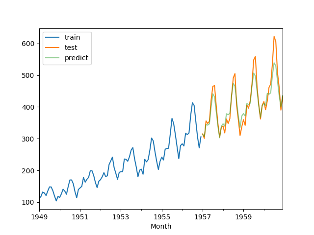

## Background
TSFrame is a project used for univariate time series forecasting. 
Python 3.6 is required.

##### Features:
* support STL/RobustSTL/X11 for time series decomposition
* support Arima/Holt/Prophet for time series forecasting
* no-decompose mode: predict the time series data directly
* decompose mode:
  1. decompose the data into three components: trend, seasonal and residual
  2. predict each component separately with specified model
  3. aggregate the results as the final prediction
* in-sample & out-of-sample predictions
* easy to extend for more models

## Quick Start

```shell
python main.py
```

## Usage

Refr to [Config.py](Config.py) for the docs on how to change the default parameters for your own time series forecasting task.

## Examples

Use the default parameters provided in [Config.py](Config.py)

##### Decompose Mode (Holt for trend, Prophet for seasonal, Arima for residual)

* Decompose result 

  

* trend prediction

  

* seasonal prediction

  

* residual prediction

  

* final prediction

  

##### No-decompose Mode (use Arima)


